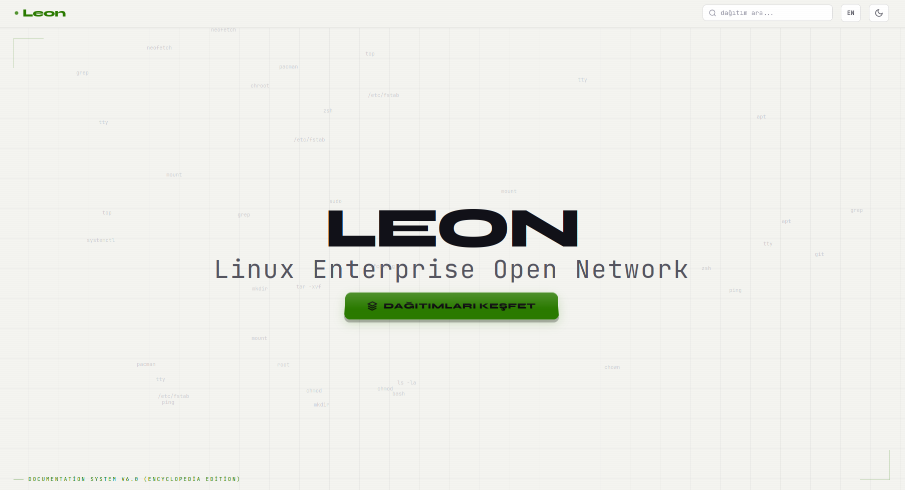
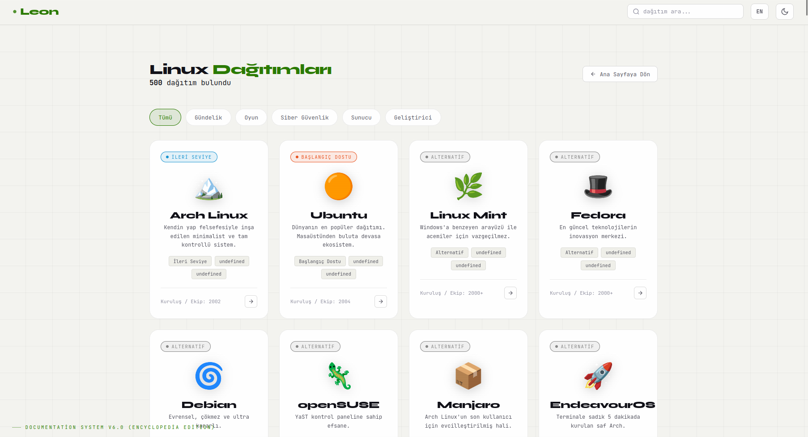
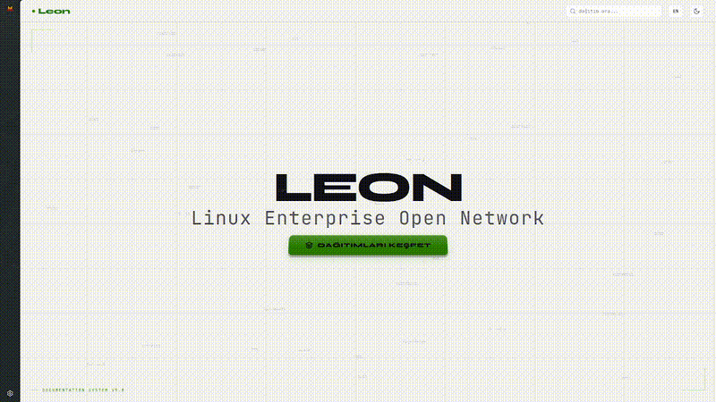

<p align="center">
  
</p>

<h1 align="center">🐧 LEON — Linux Encyclopedia</h1>

<p align="center">
  <b>Documentation System v1.2</b><br>
  <i>Linux Enterprise Open Network</i>
</p>

<p align="center">
  <a href="https://muhammedokbi.github.io/LEON/">🌐 Canlı Demo</a> •
  <a href="#özellikler">✨ Özellikler</a> •
  <a href="#ekran-görüntüleri">📸 Ekran Görüntüleri</a> •
  <a href="#kurulum">🚀 Kurulum</a> •
  <a href="#teknolojiler">🛠️ Teknolojiler</a>
</p>

<p align="center">
  
  
  
  
</p>

---

## 📖 Hakkında

**Leon**, dünya üzerindeki **500 Linux dağıtımını** tek bir çatı altında toplayan, tamamen statik ve sunucu gerektirmeyen bir **Linux Ansiklopedisi**'dir. Wikipedia API'den çekilen veriler ve elle yazılmış detaylı kurulum rehberleriyle, her seviyeden kullanıcıya hitap eden profesyonel bir referans kaynağıdır.

Her dağıtım için:
- 🏷️ Kategori etiketi (Gündelik, Oyun, Siber Güvenlik, Sunucu, Geliştirici)
- 📥 Doğrudan ISO indirme bağlantısı
- 📋 4 aşamalı detaylı kurulum rehberi
- 💻 Terminal komutları ve paket yöneticisi bilgisi
- ✅ Artıları ve ❌ Eksileri
- 🖥️ Masaüstü ortamı önizlemesi (7 farklı DE)
- 🎯 Kullanım alanları ve hedef kitle

---

## ✨ Özellikler

### 🗂️ Akıllı Kategori Filtreleme
Dağıtımları kullanım amacına göre anında filtreyin:

| Kategori | Emoji | Örnek Dağıtımlar | Adet |
|----------|-------|-------------------|------|
| **Tümü** | 🌐 | Tüm dağıtımlar | 500 |
| **Gündelik** | 🏠 | Ubuntu, Linux Mint, Zorin OS, elementary OS | 83 |
| **Oyun** | 🎮 | Manjaro, Pop!_OS, Garuda Linux | 92 |
| **Siber Güvenlik** | 🔒 | Kali Linux, Parrot OS, Tails | 104 |
| **Sunucu** | 🖧 | Debian, Rocky Linux, Alpine Linux | 125 |
| **Geliştirici** | 💻 | Arch Linux, Fedora, NixOS, EndeavourOS | 96 |

### 📥 ISO İndirme Butonu
Her dağıtımın detay sayfasında parlayan gradient **"İNDİR (ISO)"** butonu ile doğrudan resmi indirme sayfasına yönlendirme.

### 🌓 Beyaz / Karanlık Tema
- Varsayılan olarak **beyaz (light) tema** ile başlar
- Tek tıkla karanlık moda geçiş
- Tercih `localStorage`'da kalıcı olarak saklanır
- İşletim sistemi karanlık mod tercihini otomatik algılar

### 🌍 Çoklu Dil Desteği
Türkçe (TR) ve İngilizce (EN) arasında anlık geçiş. Tüm arayüz elemanları, etiketler ve açıklamalar iki dilde mevcuttur.

### 🖥️ 7 Masaüstü Ortamı Önizlemesi
Gerçek ekran görüntüleriyle masaüstü ortamlarını keşfedin:

| Masaüstü | Açıklama |
|----------|----------|
| GNOME | Modern, minimalist iş akışı |
| KDE Plasma | Sınırsız özelleştirme |
| XFCE | Hafif ve hızlı |
| Cinnamon | Windows benzeri klasik tasarım |
| COSMIC | Yeni nesil tiling desteği |
| MATE | GNOME 2 tabanlı geleneksel |
| JWM | Ultra hafif pencere yöneticisi |

### 🔍 Anlık Arama
500 dağıtım arasında isim, etiket, açıklama veya badge ile anlık arama yapın.

### 📱 Tam Responsive
Masaüstü, tablet ve mobil cihazlarda sorunsuz çalışır. Kategori butonları mobilde yatay kaydırılabilir.

---

## 📸 Ekran Görüntüleri

### Ana Sayfa (Light Tema)
<p align="center">
  
</p>

### Dağıtım Keşif Paneli
<p align="center">
  
</p>

### 🎬 Tanıtım Videosu

<p align="center">
  
</p>

<p align="center">
  <a href="https://github.com/Muhammedokbi/LEON/blob/main/assets/leon_demo.mp4">📹 Tam videoyu izle (HD)</a>
</p>

---

## 🚀 Kurulum

### Ön Gereksinimler
- Herhangi bir modern web tarayıcı (Chrome, Firefox, Safari, Edge)
- (Opsiyonel) Python 3 — sadece veritabanı yeniden oluşturulacaksa

### Yerel Çalıştırma

```bash
# Depoyu klonlayın
git clone https://github.com/Muhammedokbi/LEON.git
cd LEON

# Herhangi bir statik sunucu ile açın
# Seçenek 1: Python
python3 -m http.server 8080

# Seçenek 2: VS Code Live Server eklentisi
# Seçenek 3: Doğrudan index.html dosyasını tarayıcıda açın
```

### Veritabanını Yeniden Oluşturma (Opsiyonel)

```bash
# Wikipedia API'den 500 dağıtım çekerek distros.json'u yeniden oluşturun
python3 backend/fetch_api.py
```

### GitHub Pages'a Deploy

```bash
git add -A
git commit -m "v6.0: Yeni özellikler"
git push origin main
```

> GitHub Pages otomatik olarak `main` branch'inden deploy eder. 2-3 dakika sonra site güncellenir.

---

## 📁 Proje Yapısı

```
LEON/
├── index.html                  # Ana sayfa
├── README.md                   # Bu dosya
├── assets/                     # Görseller
│   ├── GNOME_Shell.png         # GNOME masaüstü görüntüsü
│   ├── KDE_Plasma_6.4.5_Light.png  # KDE Plasma görüntüsü
│   ├── XFCE_4.20.png           # XFCE görüntüsü
│   ├── Cinnamon_4.4.8_on_Linux_Mint_19.3.png  # Cinnamon görüntüsü
│   ├── COSMIC_Epoch_1.0.0_alpha_with_apps.png  # COSMIC görüntüsü
│   ├── Ubuntu_MATE_16.04_screenshot.png  # MATE görüntüsü
│   ├── PuppyLinuxWary511.png   # JWM (Puppy) görüntüsü
│   ├── screenshot_hero.png     # README hero görseli
│   └── screenshot_grid.png     # README grid görseli
├── css/
│   ├── base.css                # Temalar, CSS değişkenleri, temel stiller
│   ├── layout.css              # Header, hero, panel, modal düzeni
│   ├── components.css          # Kartlar, butonlar, filtreler, indirme butonu
│   └── mobile.css              # Responsive mobil stilleri
├── js/
│   ├── data.js                 # Masaüstü ortamları, i18n çevirileri, fetch API
│   ├── ui.js                   # Filtreleme, grid render, modal açma/kapama
│   ├── main.js                 # Tema toggle, dil değiştirme, olay dinleyicileri
│   └── physics.js              # Arka plan animasyonları (floating terminal commands)
└── backend/
    ├── fetch_api.py             # Wikipedia API scraper + veritabanı oluşturucu
    └── distros.json             # 500 Linux dağıtımı verisi (oluşturulan)
```

---

## 🛠️ Teknolojiler

| Teknoloji | Kullanım |
|-----------|----------|
| **HTML5** | Semantik yapı, SEO, erişilebilirlik |
| **CSS3** | Tema sistemi (CSS Variables), grid, flexbox, animasyonlar |
| **Vanilla JavaScript** | Framework'süz, saf JS ile filtreleme, arama, tema yönetimi |
| **Google Fonts** | JetBrains Mono (hacker estetiği) + Syne (başlıklar) |
| **Wikipedia API** | 500 Linux dağıtımı verisi |
| **GitHub Pages** | Statik hosting |

---

## 🔮 Gelecek Planları (Roadmap)

### 🔐 Faz 1 — Kullanıcı Kayıt Sistemi
- [ ] Kullanıcı kayıt ve giriş (Sign Up / Login) sistemi
- [ ] Admin paneli — Kullanıcı yönetimi, içerik moderasyonu
- [ ] Normal kullanıcı paneli — Profil, favoriler, geçmiş

### 🤖 Faz 2 — Yapay Zeka (LLM) Entegrasyonu
- [ ] Kayıtlı kullanıcılara özel **Linux danışman LLM** (AI asistan)
- [ ] "Hangi Linux bana uygun?" kişiselleştirilmiş öneri sistemi
- [ ] Dağıtım hakkında sohbet edebilme (Chat özelliği)

### 💻 Faz 3 — Canlı Demo Sistemi
- [ ] Siteden doğrudan Linux dağıtımlarını **demo olarak deneyebilme**
- [ ] Tarayıcı üzerinden sanal makine veya container tabanlı önizleme
- [ ] Kayıt yapan kullanıcıların istedikleri Linux'u denemesi

### 💰 Faz 4 — Premium Özellikler
- [ ] Premium kayıt sistemi (ücretli üyelik)
- [ ] Premium kullanıcılara özel gelişmiş LLM erişimi
- [ ] Özel sohbet odaları ve topluluk forumu
- [ ] Dağıtım karşılaştırma aracı

---

## 👨‍💻 Geliştirici

**Muhammed Okbi**  
🔗 [GitHub](https://github.com/Muhammedokbi) · 🌐 [Leon Live](https://muhammedokbi.github.io/LEON/)

---

## 📄 Lisans

Bu proje [MIT Lisansı](LICENSE) altında lisanslanmıştır. Özgürce kullanabilir, değiştirebilir ve dağıtabilirsiniz Yakinda Kapali Kaynak Olcak.

---

<p align="center">
  <b>Leon 🐧 — Linux dünyasının kapısını aralayın.</b>
</p>
